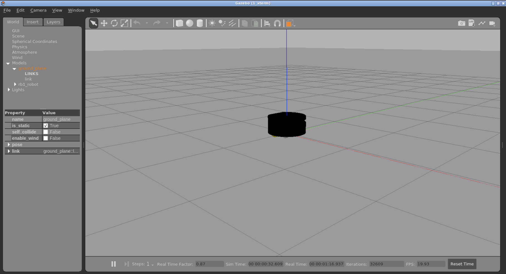

# CheckPoint 15
The construct's CP 15 project
## introduction
This respository contains files required by the checkpoint 15.
- There is already a URDF, XACRO files for robot Description
- Task 1: The student should be able to modify it in such a way that it has ros control to control differentail drive of the mobile robot
- Task 2: The student should be able to modify it to lift/unlift the elevator 




## Installation
```
git clone https://github.com/peerajak/ros2_control_cp15.git
cd ~/ros2_ws/
colcon build; source install/setup.bash
```
## Getting started
```
ros2 launch rb1_ros2_description rb1_ros2_xacro.launch.py
```
wait for approximately 3 minuits
## test Controller activation
```
ros2 control list_controllers --controller-manager /rb1_robot/controller_manager
```
##  To list all ros2 controllers' hardware interface
```
ros2 control list_hardware_interfaces --controller-manager /rb1_robot/controller_manager
```
## Move robot

### Move robot 
- To move the robot position
```
ros2 topic pub --rate 10 /rb1_robot/diffbot_base_controller/cmd_vel_unstamped geometry_msgs/msg/Twist "{linear: {x: 0.5, y: 0, z: 0.0}, angular: {x: 0.0,y: 0.0, z: 0.0}}"
```
- To lift the elevator
```
ros2 service call /apply_joint_effort gazebo_msgs/srv/ApplyJointEffort '{joint_name: "robot_elevator_platform_joint", effort: 1.0, start_time: {sec: 0, nanosec: 0}, duration: {sec: -1, nanosec: 0} }'
```
- To unlift the elevator
```
ros2 service call /clear_joint_efforts 'gazebo_msgs/srv/JointRequest' '{joint_name: "robot_elevator_platform_joint"}'
```

## Helper commands

- Translate xacro to urdf
```
xacro xacro/rb1_ros2_base.urdf.xacro  robot_name:=rb1_robot > translated_rb1_ros2_base.urdf
```